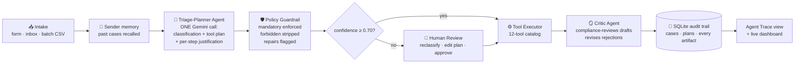

# 🛰️ OpsPilot — Agentic Request Triage & Remediation

**A proof-of-concept for the Incoming Request Processing Workflow brief** — an AI system
that receives customer requests, classifies them by type and urgency, and executes a
distinct multi-step remediation workflow per type, with a human in the loop where it
matters.

> **The one-line difference:** OpsPilot is not a classifier bolted onto hardcoded
> `if/else`. It is a **policy-constrained autonomous agent** — the AI composes its own
> remediation plan and justifies every step; deterministic guardrails keep it inside
> policy; everything it thinks is auditable on screen.

| | |
|---|---|
| 🔗 Live demo | `<https://opspilot-autonomous-agent.streamlit.app/>` |
| 🎥 Video walkthrough | `<link, ≤3 min>` |
| 🧰 Stack | Python · Streamlit · Gemini 2.5 Flash (structured output, free tier) · SQLite |

---

## How the agent works



1. **Perceive** — the request is normalized and the sender's history is recalled from
   past cases (agent memory).
2. **Reason & plan** — one JSON-schema-enforced Gemini call returns the classification
   (type, urgency, confidence, sentiment, rationale) **and a self-composed plan**: an
   ordered list of tool calls, each with the agent's written justification.
3. **Guard** — a deterministic policy layer repairs the plan against the playbook:
   mandatory steps inserted, forbidden actions stripped, every repair flagged in the UI.
4. **Gate** — below the confidence threshold (default 0.70) *nothing executes*; the case
   waits in a Human Review queue where an operator reclassifies, edits, and approves.
5. **Act** — the executor runs the plan tool-by-tool; every artifact (drafts, routing
   records, alerts, timers) is persisted.
6. **Reflect** — a critic agent reviews customer-facing drafts against a compliance
   checklist (no fault admission, no compensation promises, no invented facts) and
   revises rejected ones — original vs. revised shown side-by-side.
7. **Record** — the full reasoning trace lands in a glass-box audit trail, re-renderable
   for any case from the Dashboard tab.

## Request types & remediation playbooks

| Type | Default urgency | Mandatory steps (guardrail-enforced) | Agent-optional steps | Terminal status |
|---|---|---|---|---|
| 😤 Complaint | High | empathetic ack → escalate to senior handler → priority log → 2h follow-up | notify_supervisor, send_response | `ESCALATED` |
| ❓ General Enquiry | Low | KB lookup → grounded answer → send → resolve | schedule_follow_up | `RESOLVED` |
| 🔧 Service Request | Medium | extract details → route to department → confirmation → SLA timer | schedule_follow_up, send_response | `ROUTED` |
| 🚨 Escalation/Urgent | Critical | **pause automation (hold for human)** → de-escalating ack → notify supervisor | log_priority, escalate_case | `HELD_FOR_HUMAN` |

Type and urgency are judged **independently**, and optional steps require a concrete,
request-specific justification — visible on every plan row.

## Quickstart (local)

```bash
cd opspilot
python3 -m venv .venv && source .venv/bin/activate      # Python 3.10+
pip install -r requirements.txt
cp .env.example .env    # paste your key from https://aistudio.google.com/apikey
streamlit run app.py
```

Cloud deployment: see [`DEPLOYMENT.md`](DEPLOYMENT.md).

**No API key? It still runs.** The resilience chain degrades gracefully: backoff retries
→ fallback model (`gemini-2.5-flash` → `gemini-2.5-flash-lite`) → fully offline mode
(keyword triage with confidence capped at 0.5, which routes every case to human review
by construction; drafts fall back to safe templates). A quota error can never crash a
demo.

## Five-minute evaluator tour

Use the **simulated inbox** on the Process Request tab, in this order:

1. **#1 — "Charged twice on my June invoice"** → Complaint/High. Watch the trace: the
   agent's rationale and confidence, then the plan — note it typically **adds optional
   steps with its own justification** (e.g., supervisor alert for a 3-year customer).
   If the critic rejects the first draft you'll see the original vs. revised side-by-side.
2. **#10 — "Overcharged AGAIN"** (same sender) → the **memory moment**: the agent recalls
   the prior escalated case in its memory note and adapts the plan because of it.
3. **#5 — broadband installation** → Service Request: structured extraction
   (`ACC-2231`, weekend preference) → routed to Field Services → confirmation → 24h SLA.
4. **#7 — "NO SERVICE FOR 3 DAYS"** → Critical: automation pauses itself, supervisor
   alerted, case `HELD_FOR_HUMAN` → resolve it on the **Human Review** tab.
5. **#9 — ambiguous (bill query + new line)** → confidence lands ~0.6, below threshold:
   **nothing executes**. On the Human Review tab, fix the type, edit the plan, approve —
   the case is re-run and badged `human override`.
6. **Dashboard & Audit** — volumes, statuses, % of plans the guardrail repaired, and a
   drill-down that re-renders any case's full reasoning from the audit trail.

Also try the sidebar: switch to **Propose & confirm** (every plan needs approval),
toggle the critic, move the confidence threshold.

## Repository map

| File | Role |
|---|---|
| `agent.py` | The agent loop: perceive → plan → guard → gate → act → reflect → record |
| `gemini_client.py` | All model access: fused triage+plan call, drafts, extraction, critic — behind the 3-tier resilience chain |
| `guardrails.py` | Playbook policy as data + `validate_and_repair_plan()` |
| `tools.py` | The 12-tool catalog the agent plans with |
| `memory.py` | Sender-history recall |
| `db.py` | SQLite: `cases`, `plans` (proposed & final), `audit_log` |
| `app.py` / `ui.py` | Streamlit app / presentation layer |
| `seed_data.py`, `data/sample_requests.csv` | Simulated inbox & batch sample (10 requests, incl. one ambiguous case and one repeat sender) |

## Design decisions (and why)

- **One fused classify+plan call** — halves quota use on the free tier (~10 req/min) and
  makes the plan coherent with the classification rationale.
- **Agent autonomy *inside* policy** — the playbook (mandatory/optional/forbidden per
  type) is data in `guardrails.py`; the agent proposes, the validator disposes. This is
  the production-trust story, not just a demo trick.
- **Custom ~100-line agent loop instead of a framework** — the orchestration *is* the
  assessment; every line is explainable, and there's no dependency risk in a 3-day build.
- **Simulated side-effects** — routing, alerts, and reminders are structured artifacts in
  the audit trail rather than real emails; the tool contracts are stable, so swapping in
  Gmail/Slack/ticketing integrations is roadmap, not rework.

## Beyond the brief

All four optional enhancements are implemented — batch processing, audit trail, summary
dashboard, human override — plus four that aren't in the brief: **sender memory**,
**critic agent**, **autonomy modes**, and **offline resilience**.

## Next steps with more time

Real channel integrations (email/Slack/ticketing) · RAG knowledge base · learning loop
from human overrides · background SLA enforcement · labeled evaluation harness for
regression-testing prompt changes.
